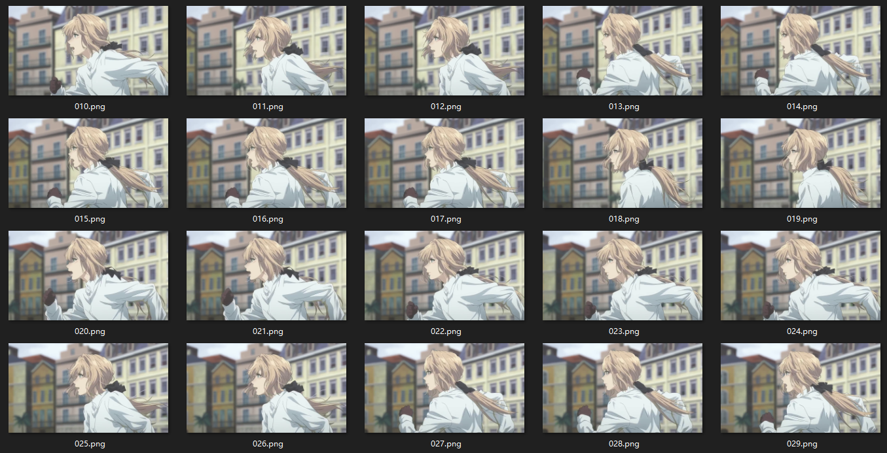
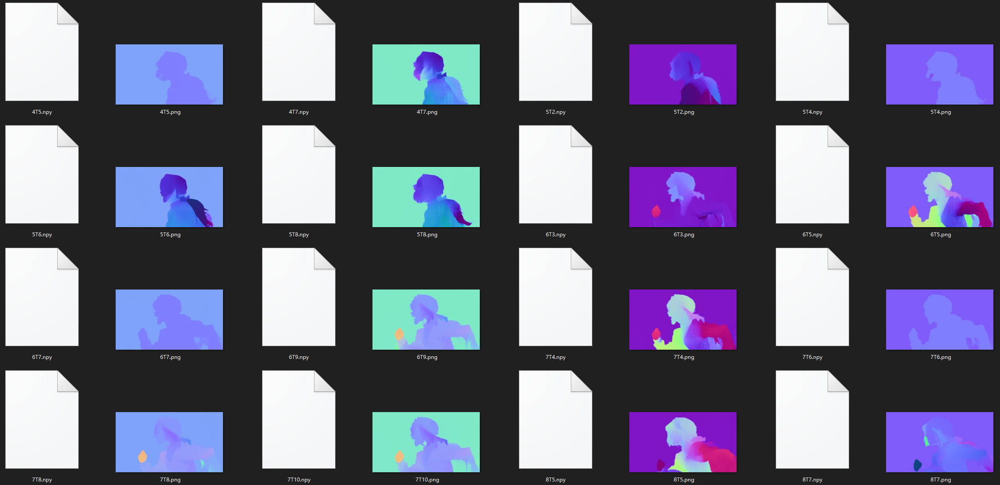
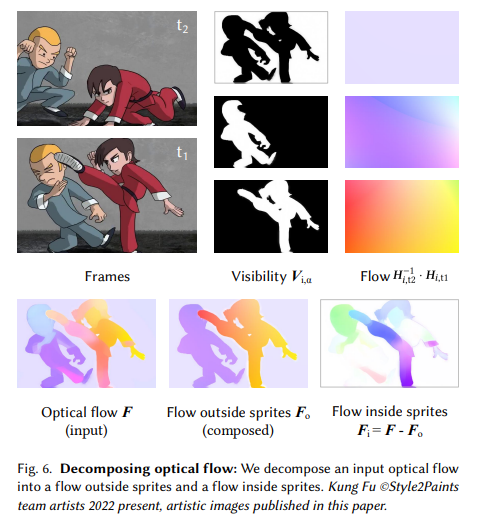

# ToonDecompose

The project ToonDecompose is conducted by S2PR to find a way to decompose a cartoon animation into several components (or called "Sprites" in terminology). 

The **inputs** should be 

* Frame images (from an animation video clip).
* Number of wanted components/objects/sprites.

The **outputs** are

* All components' contents (sequential images).
* All components' transforms (sequential homography matrices).

Note that we do NOT want to require users to give any masks of objects, and the entire processing can be fully automatic (unless users want to indicate some instructions, in some special use cases).

Besides, this project use [RAFT](https://github.com/princeton-vl/RAFT) to compute optical flows. Since the optical flow is the only introduced external model prior, trying other models like [FlowNet2](https://github.com/NVIDIA/flownet2-pytorch) are definitely some other options.

We have also published an academic paper (in SIGGRAPH Asia 2022) during the conducting of this project (See also the Citation section).

# Installation

You will need a python 3 environment of Pytorch with CUDA enabled.

    git clone https://github.com/lllyasviel/ToonDecompose.git
    cd ToonDecompose
    pip install -r requirements.txt

For Pytorch, I am using

    torch==1.7.1+cu110
    torchvision==0.8.2+cu110

But I have also tried different versions and many versions should work.

# Hello Violet

In the folder "data\violet", we include a sequence of 78 frames (000.png ~ 077.png), sampled from the animation ["Violet Evergarden"](https://www.youtube.com/results?search_query=Violet+Evergarden).

A screenshot is like this:

This Violet example is a good input because

* It is small. Downloading is fast.
* It is real. This Violet is from a REAL animation in the real productions, NOT some toy examples synthesized in some university labs. *(Violet Evergarden is generally considered one of KyoAni's peaks, and is the most well-produced anime between 2015 and 2022.)*
* It is challenging. The motion is very large. The girl is running. Even latest optical flow methods and correspondence-based decomposition methods would fail in this example.

Because of these, we use this example as a typical test.

## Configuration

In "config.py", line 8, we can edit the codes to target a directory for frames

    task_name = 'violet'
    input_path = './data/' + task_name + '/'

The "task_name" can be edited to read different examples, like your own inputs. We highly encourage to first use the default "task_name" to see whether the codes work as expected.

Besides, the number of objects is specified at line 39:

    number_of_objects = 2

By default it is 2.

## Step 0: Compute Optical Flows

Run this to start this step

    python step_0_optical_flow.py

If this works properly, you should see the optical flows computed in "workers\violet\flow".

Note that the direction of the flows are visualized with the normal ball (different from mainstream visualizations that use hue wheels). The advantage is that the scale of visualization is invariant across different flow instances.

Ideally, we should compute all flows from N frames to N frames, resulting in N*N flow instances, but that requires too much computation power. In most cases, using a window of 6 frame yields good enough results.

To be specific, we compute 4 flows for each frame at the step of 2, like:

    Flow from frame N to frame N - 3
    Flow from frame N to frame N - 1
    Flow from frame N to frame N + 1
    Flow from frame N to frame N + 3

For example,

    ...
    Flow from frame 9 to frame 6 (stored as "workers\violet\flow\9T6.npy")
    Flow from frame 9 to frame 8 (stored as "workers\violet\flow\9T8.npy")
    Flow from frame 9 to frame 10 (stored as "workers\violet\flow\9T10.npy")
    Flow from frame 9 to frame 12 (stored as "workers\violet\flow\9T12.npy")
    Flow from frame 10 to frame 7 (stored as "workers\violet\flow\10T7.npy")
    Flow from frame 10 to frame 9 (stored as "workers\violet\flow\10T9.npy")
    Flow from frame 10 to frame 11 (stored as "workers\violet\flow\10T11.npy")
    Flow from frame 10 to frame 13 (stored as "workers\violet\flow\10T13.npy")
    ...

Each flow has a "npy" file of original flow and a "png" image of visualization.

## Step 1: Warmup Object Alpha

Run this to start this step

    python step_1_warmup_alpha.py

In this step, we will warmup the alpha of each object with a method to analyze the "flow inside/outside each objects". A more detailed explanation can be found the section 3.2 of our SA2022 paper (see also the Citation section).

# Citation

The following paper describes several methods used in this project. 

    @Article{ZhangSA2022,
       author    = {Lvmin Zhang and Tien-Tsin Wong and Yuxin Liu},
       title     = {Sprite-from-Sprite: Cartoon Animation Decomposition with Self-supervised Sprite Estimation},
       journal   = "Transactions on Graphics (SIGGRAPH Asia 2022)",
       year      = 2022,
       volume    = 31,
       number    = 1,
    }

The above paper has a [project page]().

# TODO List

* refactor the code and increase readability.
* make a separated branch for that SA2022 paper and include codes that corresponds more precisely to the paper.
* include some download links of more example inputs (with copyrights).

# 中文社区

我们有一个除了技术什么东西都聊的以技术交流为主的群。如果你一次加群失败，可以多次尝试: 816096787。

